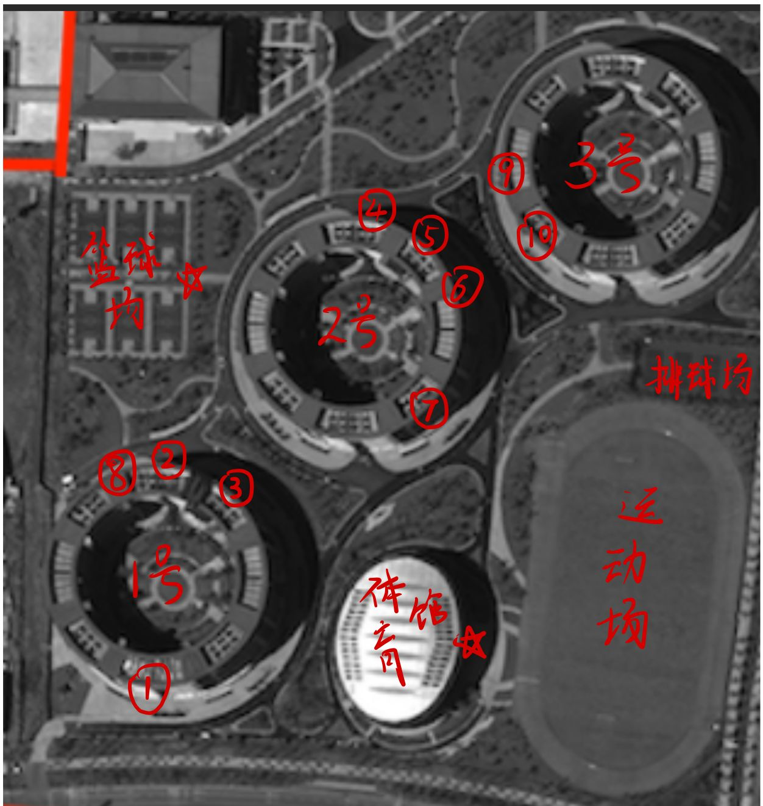
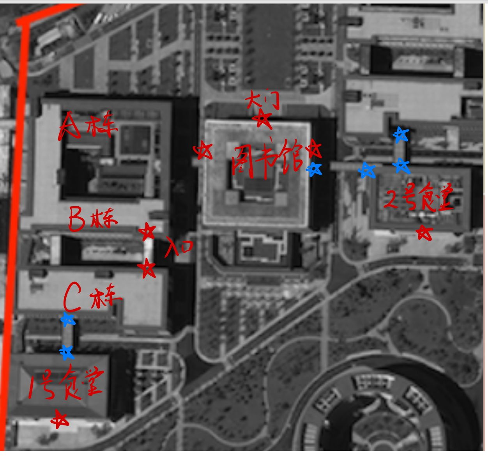
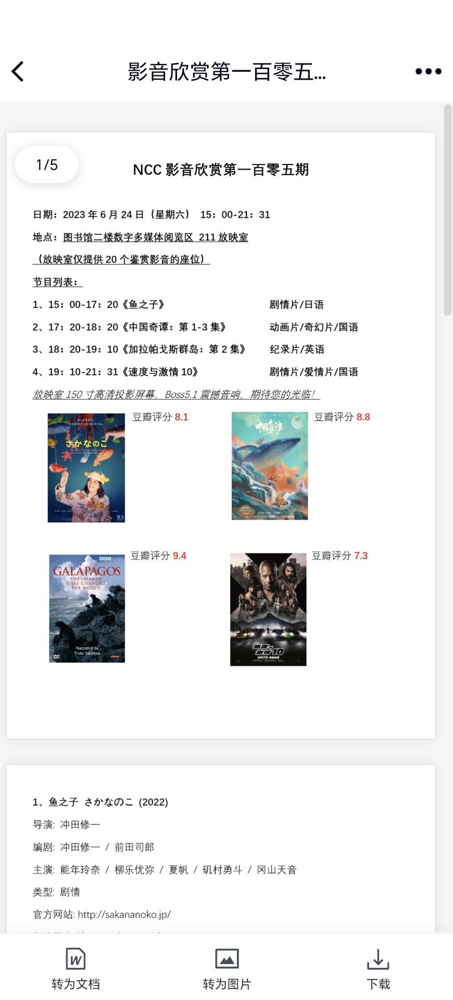

# 基地结构

### 一图流（附一句话介绍）

- 原卫星航拍图来源：美国CSET，[National Cybersecurity Center Map - Center for Security and Emerging Technology (georgetown.edu)](https://cset.georgetown.edu/publication/national-cybersecurity-center-map/)
- 制作方式：ipad画的，下面开始分部介绍：
- **已知常用的基地门**（上图以五角星标出）：
  - 南门：特点是靠近一号楼，WHU的同学们可以方便出行
  - 东一门，特点是：基地的**地铁摆渡车**默认从这里发车（但可以让司机去东二门）（地铁摆渡车请参考后文“出行”）
  - 东二门，特点是：
    - 有一个外卖桌，大多数外卖都在这拿，有保安，也很安全
    - 靠近基地对面的**远洋世界**，撸串常用集合地点
    - 离宿舍楼都很近，是最常用的门
- **培训中心**：在上图中，只有右半部分是武大和华科的地盘（悲），网安基地的另一半基本都是培训中心，左上角的未被红框框起来的部分我甚至不知道是什么东西，好像是各大公司的地盘。
  - 至于为什么要把左下角也框进来，是因为**小道消息**所言，21级的同学们由于人太多，要住在培训中心三栋楼之一的**所谓的的4号楼**，但我不知道4号楼在哪，所以大家可以开个盲盒。
  - 培训中心有各式各样的人，同样据**小道消息**所言，会有东湖学院等其他学校的学生过来培训，似乎培训中心的另外三栋宿舍楼就是给他们住的。
- **1号楼**：武大男生专属宿舍楼
- **2号楼**：女生宿舍楼，基地的**全部女生**（包括武大和华科的）都住在这里，也有**部分男生**（这个后面再说）
- **3号楼**：华科男生专属宿舍楼
- **体育馆**：基地非常不错的室内体育馆，包括恒温泳池（一楼）、室内篮球场（二楼）、室内羽毛球场（二楼）等运动场所，使用细节后面再说

- **排球场，运动场**：这个真的需要介绍吗
- **篮球场**：这个感觉也不需要，有一说一场子不错，但地不是很平，容易积水
- **一号食堂**：由于靠近新珈楼，俗称武大食堂
- **二号食堂**：由于靠近明德楼，俗称华科食堂

- **新珈楼**：武大的楼，集实验楼、教学楼、办公楼一体
- **图书馆**：世界一流图书馆，没话说
- **明德楼**：华科的楼

### 生活区

- 基地的宿舍楼呈圆环架构，一栋楼有**八个单元**，按照**逆时针顺序**排列，一个单元有**七个楼层**，单独配备一个电梯，每单元的每楼层有**两个套间**，每个套间有**三单人间+三双人间**。下面会告知某一个单元的入口的具体位置，还请各位自行推算自己的单元在哪

- 五角星的意义为：**入口**

#### 1号楼

- 1号楼整体是四通八达的，几乎每个单元都会有一个外圈门和内圈门，值得强调的是，**宿舍楼并非彻底的环结构**，而是有四个缺口，从外面可以直接进到内圈，内圈可以晒被子。（但2号楼不是这样，后面细说）

- ① 医务室
  - 医务室有常见的药物，可以看一些**感冒发烧类型的小病**，工作时间约为**早上9点到晚上9点**，吃饭时间会休息。
  - 可以报销，武大会在**每年6月初统一报销**；一般来说，报销的发票可以在看病后2-3周内取得，部分极端情况需要很久，但每年报销前，医务室会把一年内所有的发票都放在门口，大家可以去自行取得。
  - 不太正常的tips：如果需要急救120，自行打120是要给急救车钱的，但是让医务室打不用（不要问我怎么知道这些的）
- ② 理发店
  - 理发店有两名理发师，水平不好不差，默认给男生剪成**两边后面剃光光、中间上面留一半的**小飞机头型，但本人实测，如果**跟理发师仔细沟通**，他还是能按照要求剪的。
  - 理发师工作时间：早上9点到晚上6点（？）左右，饭点会休息。
  - 男生洗剪吹**一次35元**，**会员卡25元**，会员卡办理条件：**一次性充值200元。**
  - 女生怎么剪的我不知道，说实话**一年来我没在理发店见到女生**；理发店的其他服务也不知道情况如何，但，**真要烫发染发咱还是出基地吧。**
  - 理发店有微信群，但我没加，感觉没什么必要，有需求的同学可以试图问问其他人。
- ③ 中百好邦超市
  - 本条请和 **④中百罗森超市** 结合观看，是唯二的基地超市。
  - 中百好邦超市的售卖范围（特点物品标黑）：
    - 常见的零食饮料，有冰柜，无熟食。
    - **部分家具**，如碗筷瓢盆，晾衣杆扫把拖把等，也有很多小物品，缺东西时可以尝试去逛逛。
    - **部分文具**，包括胶水订书机文件夹等也有。
    - **一些新鲜水果**，苹果香蕉梨等常见水果，价格适中，但基地外的水果店更好一些。
    - 促销活动不多
  - 营业时间：早7点（反正我有一次7点起来是看见开门了）至晚上10点左右，这个不太明确。
- **⑧ 一单元的入口点**
- **补充：活动室**
  - 在好邦超市左边有一个活动室，里面有钢琴，还有大桌子和电视什么的，据洪伟老师所述，是给我们提供自由活动的空间的，可以找辅导员借。

#### 2号楼

- 2号楼**并非四通八达**，上文所述的四个缺口，考虑到安全和隐私原因，约一年半前已经被水马堵死。
  - 2号楼现住有武大和华科的全部女生，其中，**4单元和7单元住的是男生**（别问我为什么这么了解）
  - 2号楼的单元外圈门，除3、4、7单元打开外，全部关闭；单元内圈门，除4、7单元关闭外，全部打开。翻译过来就是，**女生统一从3单元的外圈门进入内圈，再从内圈门进入自己的单元；男生只能从外圈门进入自己的单元**，一定程度上是隔绝了男生女生的。
  - 住在2单元的男生，晒被子建议去1号楼底下晒，也只能这样了。
- 除去标注的点位之外，2号楼一楼还有**台球室、乒乓球室和健身房**，图太小了，这里标不下了（其实是我忘了），台球室约在⑦的位置右边，乒乓球室则在⑦的左边一点，健身房大概在④的左边一点
  - 三者都是收费的，健身房是5r一次（不限时），也有月卡（200r）和年卡（700r），健身房有基本的设施，也挺热闹
  - 乒乓球室有五个乒乓球桌，5r/小时/桌（不限人数）
  - 台球室有四个球桌，支持斯诺克打法，5r/小时/桌（不限人数）
- ④ 中百罗森超市
  - 本条请和 **③中百好邦超市** 结合观看，是唯二的基地超市，和外面见到的罗森基本相同，是非常标准的现代便利店。
  - 中百罗森超市的售卖范围（特点物品标黑）：
    - 常见的零食饮料
    - **熟食**，包括饭团三明治、简单便当、蒸包、关东煮、鸡排肉串烤肠、水煮蛋、鸡胸肉、现做小蛋糕等，有微波炉可以现场加热，足够解决三餐；也有现做咖啡豆浆等。
    - **部分生活用品**：包括卫生纸、洗漱用品、卫生巾等。
    - **酒**，洋酒啤酒都有，能自己调酒喝。
    - **常有促销活动**，店员人很不错，会告诉你领券什么的。
    - 具体关注微信小程序：罗森点点
  - 营业时间：早7点（甚至某天六点半，应该是刚开门）至晚上11点。
- **⑤ 三单元的入口点**
- ⑥ 菜鸟驿站
  - 提供基本的快递暂存和快递寄送服务
  - **收货地点请填：湖北省 武汉市 东西湖区 径河街道 临空港大道国家网络安全学院菜鸟驿站**，填错了很可能会出事，比如寄到培训中心去
  - tips：最近毕业季产生了一些风波，菜鸟驿站提供的寄快递服务确实收费略贵，且有垄断嫌疑，**这里推荐在京东或顺丰的APP或小程序上预约寄送，会有专人来寝室楼下或菜鸟门口**，他们会便宜一些。
- ⑦ 桶装水店
  - 提供桶装水服务
  - 本人没用过，这里如果介绍有误还请见谅（感谢 @xn 勘误）
  - 有微信群
  - 一般流程是先给一点钱，师傅会上门给你安装饮水机，同时给你几张水票，一张水票 = 一桶水 = 10人民币，当水用完之后，空桶放在套间外的电梯口，同时放上两张水票，在微信群里@师傅，师傅就会上门取走空桶和水票，同时给你留下两桶水。
    - @xn：记得打开套间的门（如果饮水机在公共区域），这样师傅就会帮你把一桶水搬上饮水机
  - 一桶水挺多的，**推荐双人间搭伙购买，或者一整个套间搭伙购买**
  - 感觉不用担心跑路问题，似乎全基地的办公室都靠它活着（）

#### 3号楼

- 华科的楼
- ⑨ 打印店
  - 基地的打印店，价格**0.3r/一张纸**（黑白双面，单双面同价），也能打印照片（证件照等）。
  - 可以加老板QQ发文件打印，QQ请自行获取（去店里，或者询问现有NCC居民）。
  - 上班时间一般是早上8点至晚上8点左右，**在期末周的疯狂期间，老板会选择刷夜**。
  - 其他推荐的打印位置：图书馆（后面介绍，那个还有点难用哦），以及最近2号楼单元内新出现的自助打印机。
- ⑩ 奶茶店（古北沁）
  - 基地内的奶茶店（唯二），价格适中，味道适中，能解决奶茶和果茶需求。
  - 每周一有水果茶第二杯半价活动
  - 有自助水果捞
  - 有很多桌游，大多数是前人留在这的遗产，休闲时光可以过去玩。
  - 具体关注小程序：古北沁

#### 体育馆

- 基地唯一室内体育馆
- 游泳馆（一楼）
  - 室内**恒温**泳池，尽享奢华，有安保人员。
  - 10r一次，有淋浴设施，分为深水区和浅水区，浅水区约为1.5m，深水区约为1.8~2.3m（是越来越深的）（@xn 勘误）。
  - 进入深水区**需要通过考核拿到手环**，需要佩戴手环才能进入深水区。
    - 考核方式：在深水区不间断成功往返两轮（200米），速度不能太慢，至少四分钟内完成（教练说法，但大多数是看感觉）。
  - 每学期会有游泳课程，具体请关注辅导员的报名通知，是免费的，教的是蛙泳。
    - @xn：也有游泳高级班，教的是自由泳，但似乎这学期（2023.2~2023.6）没有高级
- 篮球馆（二楼）
  - 室内篮球场，据说是80r/小时（全场），由于太贵，反正我是没去过，室外的篮球场够用了。
  - 每学期也会有篮球课程，具体请关注辅导员的报名通知，同样是免费的。
  - 不可以预约，只能现场去。
- 羽毛球馆（二楼）
  - 室内羽毛球，10r/小时（不限人数），质量不错。
  - 每学期也会有羽毛球课程，具体请关注辅导员的报名通知。
  - 好像羽毛球爱好者门有一个群（？），这个我不太清楚
  - 不可以预约，只能现场去，很可能会没有位置。

#### 室外运动场所

- 篮球场
  - 有**六个篮球全场**，少量篮筐有点微小问题，日常够用，周末的晚上有时候会没地盘，感觉基地人还是不少的。
  - 部分场地可能是不平，雨后容易有一两处积水，很滑，务必小心。
  - 场地有灯，晚上十点半熄灯
- 排球场
  - 有**四个排球场**，在东二门旁边
  - 有时有人打排球，但好像大多数是HUST的，有兴趣的新朋友们也可以去打，速速来WHUer（因为我也想打）
  - 场地没有灯  
- 运动场
  - 很标准的400m操场
  - 大三下学期会有本部的老师来组织体测，一天测完所有项目
  - 有时会有草坪音乐节、趣味运动会、华科十佳歌手等活动

### 教学区

- 红色五角星为入口（处于一楼），蓝色五角星也是入口（处于二楼，常常是建筑之间的一个桥，会在饭点时打开，图中也能清楚看到都是连接食堂的桥）。

#### 食堂

- 1号食堂（武大食堂）
  - 两层结构
  - 比较特殊的是二楼的智慧餐厅，自行打菜承重并扣款的流水线型食堂，味道是不错的，但是贵，打菜时（尤其是肉）请务必收住小手，我曾有过**3块红烧肉7块钱的痛苦经历**（每一块也就我大拇指那么大）（我手很小）（2\*2\*2cm）。
  - 智慧餐厅有小程序：1号食堂，具体请亲自到场，会有工作人员教学。
  - 如果打菜过程中出现任何问题（比如夹子不小心放在了盘子上，称重了），请及时寻求旁边工作人员的帮助，他们会帮你迅速反映并退款。
  - 一楼有麻辣烫（感觉不如华科食堂）、卤肉饭、小碗菜、水吧、面馆等，自行探索咯。
- 2号食堂（华科食堂）
  - 三层结构，不过三层**据说是**宴请专席，没去过。
  - 比较特殊的是**二楼炒菜**，很好吃，也不贵，可以组队下馆子。
  - 二楼还有麻辣烫、铁板拌饭、自助饺子等。
  - 一楼有小碗菜、华科士（戏称，其实是一个炸鸡汉堡店）、奶茶店（在华科士旁边）还有一家新面馆（拌面好吃）。
    - 华科士有小程序，支持外送（到单元楼下），味道还行
    - 奶茶店有甜筒，挺好吃，奶茶偏甜（尤其是珍珠or芋圆），注意要求少糖。
  - 一楼还有一个水果和面包糕点摊，感觉很少有人买，不知道怎么开下去的（不是）。
- 以上均是个人口味，还请各位自行探索。
- **食堂经常遇到老师，请各位控制一下自己议论时的音量**。

#### 新珈楼

- 新珈楼分为A、B、C三栋，为方便管理，只开了一楼B栋和C栋的两个门方便进去（图中已标出）。
- **A栋：**
  - 办公楼，有教师和领导办公区（主要在三楼）、物业办公区（主要在二楼）、还有部分老师的研究室（四五楼），一楼是大厅，最近刚建了展示区。
  - 三楼有一个巨大的办公室，需要找的领导or老师基本上都能在那里找到
  - 办公室旁边有成绩单自助打印机

- **B栋：**
  - 教学楼，主要是教室区（一至三楼），四五楼同样是部分老师的办公室和研究室。
  - 教室分为两种，一种是正儿八经的教室，一种是有一个大方桌的讨论室（开组会，班会可以用）。
  - 教室可以借，同样是找教学办的老师签字开条，然后到A213给物业管理人员（可以提前给），物业就会在那个时间帮忙开门。
    - **请注意跟物业说明是否需要使用多媒体！！！**（当然物业有时候会主动问你），教室的多媒体是需要教师卡才能使用的。
  - 讨论室可以借，但讨论室一是不需要担心多媒体问题，随便开；二是据说开发了一个小程序用来自动借讨论室，使用掌纹开启，但这个功能暂时只有班长能使用（但我班班长说不太行），看后续发展吧。
- **C栋：**
  - 实验楼，主要是实验室和靶场等（一至三楼），四五楼同样是部分老师的研究室。
  - 二楼通桥，饭点可以去往武大食堂二楼。

#### 图书馆

- **世界一流图书馆！！！**（真不能黑，这是真一流）
- 请第一时间前往图书馆大厅，注册本人人脸和图书馆账号，网安图书馆的系统是独立的，需要刷脸进入。
  - 请关注公众号：网络安全学院图书馆，使用图书馆账号进行预约座位等功能。
  - 图书馆开放时间：早上八点至晚上十点
  - 图书馆有交流群，在群里发消息（续借xxx号箱体、打印机坏了没纸了、空调太冷了、想注册图书馆账号等问题）均能得到管理员的迅速回复。

- **图书馆共六楼**：
  - 负一楼：图书馆报告厅（大型活动的主要开展地点），还有储藏书的地下室
  - 一楼：大厅，研修室，创客空间云桌面区（唯一的24小时区）（有睡眠舱）
  - 二楼：开放座位，自助打印机，**VR体验区**（这个是真猛，建议体验一次），按摩椅，3D打印机等
  - 三楼：阅览自习区
  - 四楼：未开放
  - 五楼：自习区，**研修室，花园天台**
  - 图书馆的座位采取**预约制**（曾有过一次风波，但后期完善了制度，图书馆馆长很有耐心和工作能力），但也有独特的**箱体制度**，为了方便考研的同学，大量资料需要放在图书馆，图书馆可以借出箱体存放书籍，这个箱体可以作为占位使用（应该是），和书籍一样有限定日期，需要续借，但可以在群里完成。
  - 预约系统和WHU的大致相同，但**研修室一次最多预约4小时**。

- **图书馆的主要功能**：
  - 借阅书籍
    - 如果有想看的书，在群里发送书的图片，艾特群内专门的工作人员，**可以荐购**，只要不是太离谱，图书馆都会购置（这是真爽）
  - 自习，**注意遵守相关规定**
    - 经常有人参观，可能会有点吵，这也经常有风波
    - 但请别为难管理员，管理员也没办法
  - **玩VR（真好玩）**
  - 蹭空调
    - 图书馆不同楼层的空调效果不同，根据需要自行选择楼层，空调的温度不归管理员管（归尊贵的丽岛物业管）
  - 打印
    - 图书馆有自助打印机，自己的电脑可以下载一个**打印系统**，远程上传文件，随后前往图书馆打印取得，学会了使用后是很方便的。
    - 具体参考图书馆官网：www.ncclib.cn
    - 
  - 健身
    - 图书馆五楼有健身房（只有跑步机和少量设施，比不上收钱的那个），还有一个很大的平地，可以练舞
    - @xn：还有一面大镜子，可以练舞！
    - @xn：现在还有舞蹈课，但是是花钱请老师的，不贵
  - **看电影**
    - 图书馆会有**影音欣赏活动**，主要是周五和周六，会播放热门电影（**甚至是刚上映的电影**）、演唱会和纯音乐欣赏三种类型（每周每种类型都有），但放映室位置很少，大概20个位置（其实你也能坐地上），具体放映内容可以关注工作人员在图书馆群的消息。
    - 若有大家都想看的直播（比如LPL总决赛，足球比赛等），可以跟工作人员申请，在不打扰图书馆同学正常学习的情况下可以满足。
    - 近期的一次，看到了速度与激情10：
    - 

#### 明德楼

- 明德楼有自动售货机和咖啡机
- 新珈楼没有
- 写这条就是寄希望于后辈的
- 对了，20的习概在明德楼上的，但以后应该没机会了（习概改到了大二上）
