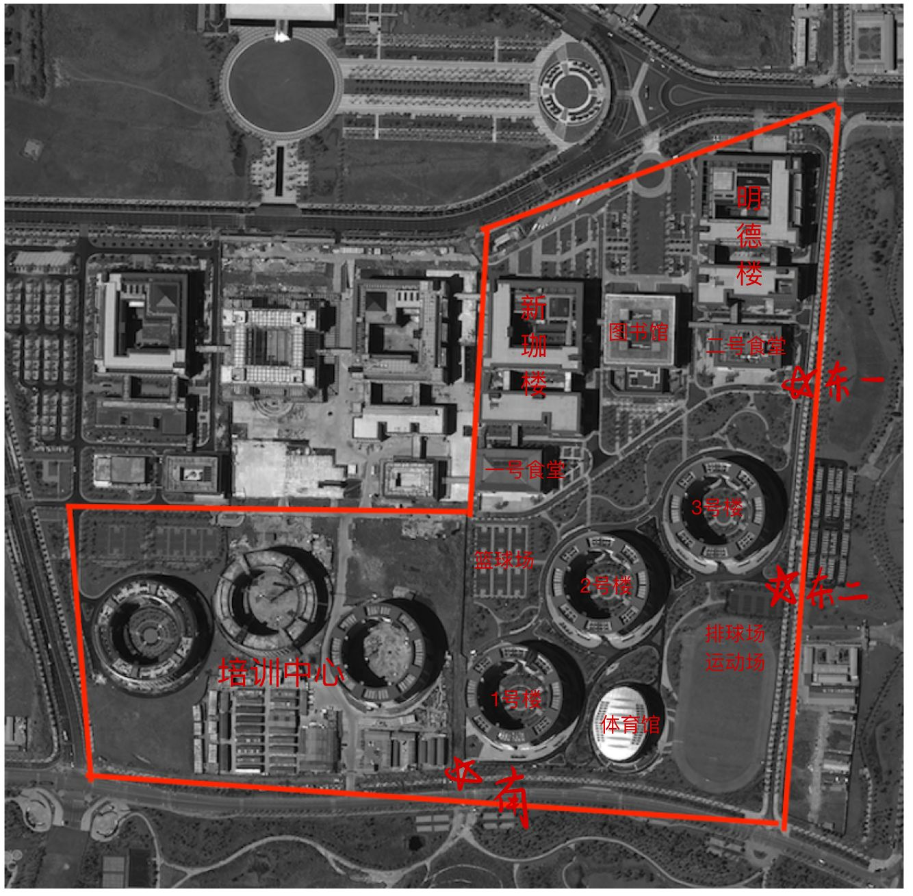
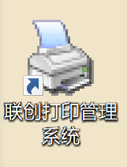
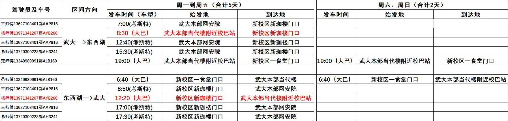
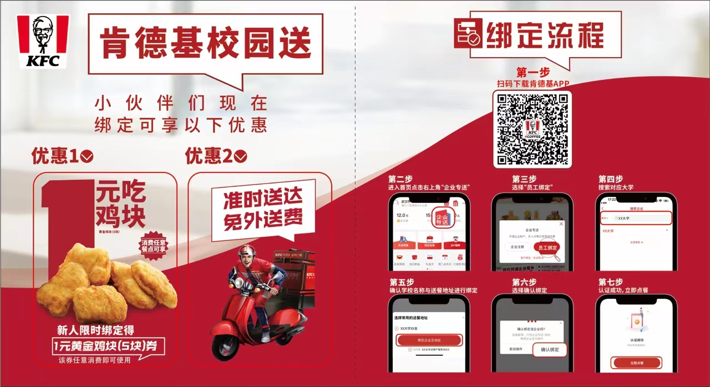
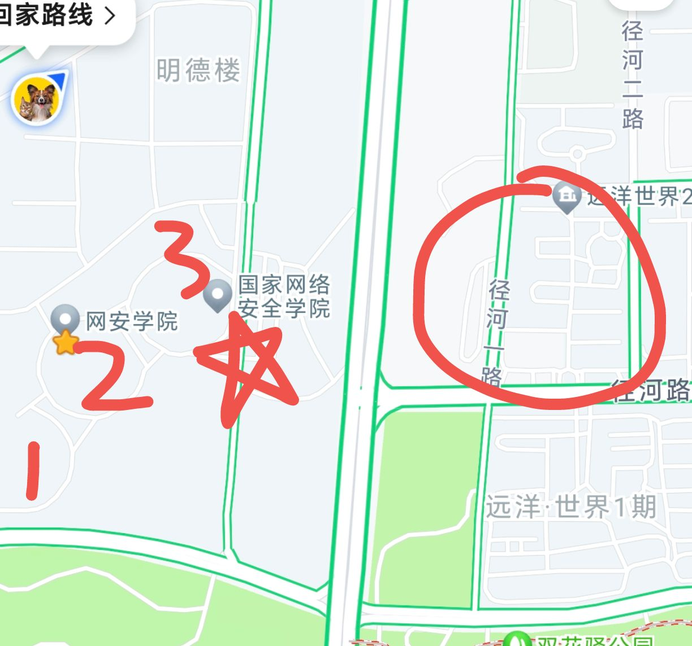
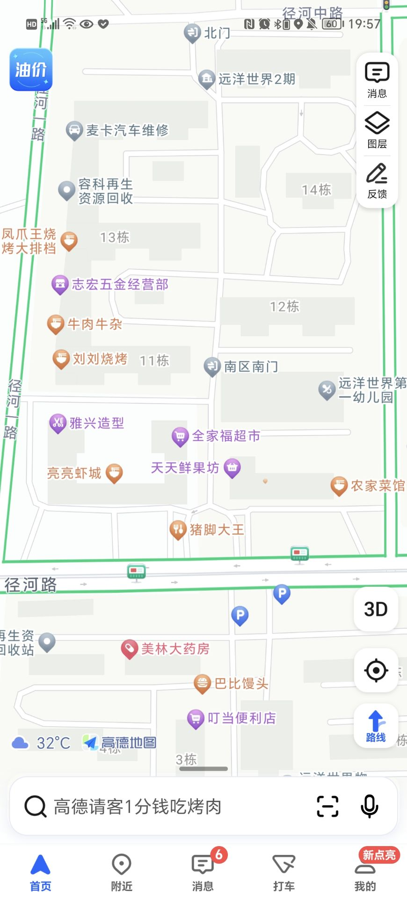

# NCC指南

## 前言

- **本指南为WHU 本科2020级@橙子 制作**
- 本指南使用Markdown简单制作，目录可使用，请各位自行使用自己的PDF阅览器打开目录
- 我知道已经有许多公开版本的NCC生活指南，但我真的没事干了，我要自己做一个
- 本指南将秉持我一向的废话风格，在可能很详细的同时废话也很多，理解一下
- 本指南只介绍我所了解的NCC，因此可能只适合WHU学生使用
- 本指南的制作动机
  - 我没事干了，总不能让我一个本科生一天做十个小时科研吧（或许有人可以）（别举报我）（我可是牺牲的打游戏时间）
  - 有一个做得很不错的版本，可惜是HUST的，我们要武大自己的指南！
  - 去年也有一个很不错的WHU版本（感谢 @QJJ不是邱姐姐 等学长，祝你们毕业快乐！），但NCC在过去一年的变化还是存在的，也产生了很多学生间的互助拼单群，个人感觉能对生活质量产生明显提升（对不起暴露了我天天玩
  - 我在基地有过很多奇特经历（），所以想做一个详细的版本，利用我的废话特征
- 可以流传，我会尽量保证内容的真实性，全面性我不敢保证（），若之后的同学们有更新or修改的需要，或本文内容有误，欢迎联系我，我会提供Markdown源码和附件。
- 本文的顺序是：先讲明白基地里面的东西，再讲基地外面的东西，并不是衣食住行的顺序，但我最后还是会总结一个
- **Ps：为了安全，本文中提到的所有群聊和联系方式，我只会告知这个群的存在，但不会给出号码或二维码等信息，群聊的大多数管理员都是为爱发电，我不能加大他们的管理难度，而且群聊也出过很多事故。请各位宝贝自行寻求学长学姐或身边同学获得，一般来说，加入了最大的群（NCC大黑市），就能很轻易地在群里问到其他群。**

- **致谢：感谢我的农友兼室友 @董哥 @峤子 ，还有我的酒友兼球友 @af @xn @kc @马哥 等人，能秒回我的提问，帮我完善这个文档**

## 目录

[TOC]

## 基地结构

### 一图流（附一句话介绍）

- 原卫星航拍图来源：美国CSET，[National Cybersecurity Center Map - Center for Security and Emerging Technology (georgetown.edu)](https://cset.georgetown.edu/publication/national-cybersecurity-center-map/)
- 制作方式：ipad画的，下面开始分部介绍：
- **已知常用的基地门**（上图以五角星标出）：
  - 南门：特点是靠近一号楼，WHU的同学们可以方便出行
  - 东一门，特点是：基地的**地铁摆渡车**默认从这里发车（但可以让司机去东二门）（地铁摆渡车请参考后文“出行”）
  - 东二门，特点是：
    - 有一个外卖桌，大多数外卖都在这拿，有保安，也很安全
    - 靠近基地对面的**远洋世界**，撸串常用集合地点
    - 离宿舍楼都很近，是最常用的门
- **培训中心**：在上图中，只有右半部分是武大和华科的地盘（悲），网安基地的另一半基本都是培训中心，左上角的未被红框框起来的部分我甚至不知道是什么东西，好像是各大公司的地盘。
  - 至于为什么要把左下角也框进来，是因为**小道消息**所言，21级的同学们由于人太多，要住在培训中心三栋楼之一的**所谓的的4号楼**，但我不知道4号楼在哪，所以大家可以开个盲盒。
  - 培训中心有各式各样的人，同样据**小道消息**所言，会有东湖学院等其他学校的学生过来培训，似乎培训中心的另外三栋宿舍楼就是给他们住的。
- **1号楼**：武大男生专属宿舍楼
- **2号楼**：女生宿舍楼，基地的**全部女生**（包括武大和华科的）都住在这里，也有**部分男生**（这个后面再说）
- **3号楼**：华科男生专属宿舍楼
- **体育馆**：基地非常不错的室内体育馆，包括恒温泳池（一楼）、室内篮球场（二楼）、室内羽毛球场（二楼）等运动场所，使用细节后面再说

- **排球场，运动场**：这个真的需要介绍吗
- **篮球场**：这个感觉也不需要，有一说一场子不错，但地不是很平，容易积水
- **一号食堂**：由于靠近新珈楼，俗称武大食堂
- **二号食堂**：由于靠近明德楼，俗称华科食堂

- **新珈楼**：武大的楼，集实验楼、教学楼、办公楼一体
- **图书馆**：世界一流图书馆，没话说
- **明德楼**：华科的楼

### 生活区

- 基地的宿舍楼呈圆环架构，一栋楼有**八个单元**，按照**逆时针顺序**排列，一个单元有**七个楼层**，单独配备一个电梯，每单元的每楼层有**两个套间**，每个套间有**三单人间+三双人间**。下面会告知某一个单元的入口的具体位置，还请各位自行推算自己的单元在哪

- 五角星的意义为：**入口**

#### 1号楼

- 1号楼整体是四通八达的，几乎每个单元都会有一个外圈门和内圈门，值得强调的是，**宿舍楼并非彻底的环结构**，而是有四个缺口，从外面可以直接进到内圈，内圈可以晒被子。（但2号楼不是这样，后面细说）

- ① 医务室

  - 医务室有常见的药物，可以看一些**感冒发烧类型的小病**，工作时间约为**早上9点到晚上9点**，吃饭时间会休息。
  - 可以报销，武大会在**每年6月初统一报销**；一般来说，报销的发票可以在看病后2-3周内取得，部分极端情况需要很久，但每年报销前，医务室会把一年内所有的发票都放在门口，大家可以去自行取得。
  - 不太正常的tips：如果需要急救120，自行打120是要给急救车钱的，但是让医务室打不用（不要问我怎么知道这些的）

  

- ② 理发店

  - 理发店有两名理发师，水平不好不差，默认给男生剪成**两边后面剃光光、中间上面留一半的**小飞机头型，但本人实测，如果**跟理发师仔细沟通**，他还是能按照要求剪的。
  - 理发师工作时间：早上9点到晚上6点（？）左右，饭点会休息。
  - 男生洗剪吹**一次35元**，**会员卡25元**，会员卡办理条件：**一次性充值200元。**
  - 女生怎么剪的我不知道，说实话**一年来我没在理发店见到女生**；理发店的其他服务也不知道情况如何，但，**真要烫发染发咱还是出基地吧。**
  - 理发店有微信群，但我没加，感觉没什么必要，有需求的同学可以试图问问其他人。

  

- ③ 中百好邦超市

  - 本条请和 **④中百罗森超市** 结合观看，是唯二的基地超市。
  - 中百好邦超市的售卖范围（特点物品标黑）：
    - 常见的零食饮料，有冰柜，无熟食。
    - **部分家具**，如碗筷瓢盆，晾衣杆扫把拖把等，也有很多小物品，缺东西时可以尝试去逛逛。
    - **部分文具**，包括胶水订书机文件夹等也有。
    - **一些新鲜水果**，苹果香蕉梨等常见水果，价格适中，但基地外的水果店更好一些。
    - 促销活动不多
  - 营业时间：早7点（反正我有一次7点起来是看见开门了）至晚上10点左右，这个不太明确。

  

- **⑧ 一单元的入口点**

- **补充：活动室**
  - 在好邦超市左边有一个活动室，里面有钢琴，还有大桌子和电视什么的，据洪伟老师所述，是给我们提供自由活动的空间的，可以找辅导员借。

#### 2号楼

- 2号楼**并非四通八达**，上文所述的四个缺口，考虑到安全和隐私原因，约一年半前已经被水马堵死。

  - 2号楼现住有武大和华科的全部女生，其中，**4单元和7单元住的是男生**（别问我为什么这么了解）
  - 2号楼的单元外圈门，除3、4、7单元打开外，全部关闭；单元内圈门，除4、7单元关闭外，全部打开。翻译过来就是，**女生统一从3单元的外圈门进入内圈，再从内圈门进入自己的单元；男生只能从外圈门进入自己的单元**，一定程度上是隔绝了男生女生的。

  - 住在2单元的男生，晒被子建议去1号楼底下晒，也只能这样了。

- 除去标注的点位之外，2号楼一楼还有**台球室、乒乓球室和健身房**，图太小了，这里标不下了（其实是我忘了），台球室约在⑦的位置右边，乒乓球室则在⑦的左边一点，健身房大概在④的左边一点
  - 三者都是收费的，健身房是5r一次（不限时），也有月卡（200r）和年卡（700r），健身房有基本的设施，也挺热闹
  - 乒乓球室有五个乒乓球桌，5r/小时/桌（不限人数）
  - 台球室有四个球桌，支持斯诺克打法，5r/小时/桌（不限人数）

- ④ 中百罗森超市

  - 本条请和 **③中百好邦超市** 结合观看，是唯二的基地超市，和外面见到的罗森基本相同，是非常标准的现代便利店。
  - 中百罗森超市的售卖范围（特点物品标黑）：
    - 常见的零食饮料
    - **熟食**，包括饭团三明治、简单便当、蒸包、关东煮、鸡排肉串烤肠、水煮蛋、鸡胸肉、现做小蛋糕等，有微波炉可以现场加热，足够解决三餐；也有现做咖啡豆浆等。
    - **部分生活用品**：包括卫生纸、洗漱用品、卫生巾等。
    - **酒**，洋酒啤酒都有，能自己调酒喝。
    - **常有促销活动**，店员人很不错，会告诉你领券什么的。
    - 具体关注微信小程序：罗森点点
  - 营业时间：早7点（甚至某天六点半，应该是刚开门）至晚上11点。

  

- **⑤ 三单元的入口点**

- ⑥ 菜鸟驿站
  - 提供基本的快递暂存和快递寄送服务
  - **收货地点请填：湖北省 武汉市 东西湖区 径河街道 临空港大道国家网络安全学院菜鸟驿站**，填错了很可能会出事，比如寄到培训中心去
  - tips：最近毕业季产生了一些风波，菜鸟驿站提供的寄快递服务确实收费略贵，且有垄断嫌疑，**这里推荐在京东或顺丰的APP或小程序上预约寄送，会有专人来寝室楼下或菜鸟门口**，他们会便宜一些。

- ⑦ 桶装水店
  - 提供桶装水服务
  - 本人没用过，这里如果介绍有误还请见谅（感谢 @xn 勘误）
  - 有微信群
  - 一般流程是先给一点钱，师傅会上门给你安装饮水机，同时给你几张水票，一张水票 = 一桶水 = 10人民币，当水用完之后，空桶放在套间外的电梯口，同时放上两张水票，在微信群里@师傅，师傅就会上门取走空桶和水票，同时给你留下两桶水。
    - @xn：记得打开套间的门（如果饮水机在公共区域），这样师傅就会帮你把一桶水搬上饮水机
  - 一桶水挺多的，**推荐双人间搭伙购买，或者一整个套间搭伙购买**
  - 感觉不用担心跑路问题，似乎全基地的办公室都靠它活着（）

#### 3号楼

- 华科的楼
- ⑨ 打印店
  - 基地的打印店，价格**0.3r/一张纸**（黑白双面，单双面同价），也能打印照片（证件照等）。
  - 可以加老板QQ发文件打印，QQ请自行获取（去店里，或者询问现有NCC居民）。
  - 上班时间一般是早上8点至晚上8点左右，**在期末周的疯狂期间，老板会选择刷夜**。
  - 其他推荐的打印位置：图书馆（后面介绍，那个还有点难用哦），以及最近2号楼单元内新出现的自助打印机。

- ⑩ 奶茶店（古北沁）
  - 基地内的奶茶店（唯二），价格适中，味道适中，能解决奶茶和果茶需求。
  - 每周一有水果茶第二杯半价活动
  - 有自助水果捞
  - 有很多桌游，大多数是前人留在这的遗产，休闲时光可以过去玩。
  - 具体关注小程序：古北沁

#### 体育馆

- 基地唯一室内体育馆
- 游泳馆（一楼）
  - 室内**恒温**泳池，尽享奢华，有安保人员。
  - 10r一次，有淋浴设施，分为深水区和浅水区，浅水区约为1.5m，深水区约为1.8~2.3m（是越来越深的）（@xn 勘误）。
  - 进入深水区**需要通过考核拿到手环**，需要佩戴手环才能进入深水区。
    - 考核方式：在深水区不间断成功往返两轮（200米），速度不能太慢，至少四分钟内完成（教练说法，但大多数是看感觉）。
  - 每学期会有游泳课程，具体请关注辅导员的报名通知，是免费的，教的是蛙泳。
    - @xn：也有游泳高级班，教的是自由泳，但似乎这学期（2023.2~2023.6）没有高级

- 篮球馆（二楼）
  - 室内篮球场，据说是80r/小时（全场），由于太贵，反正我是没去过，室外的篮球场够用了。
  - 每学期也会有篮球课程，具体请关注辅导员的报名通知，同样是免费的。
  - 不可以预约，只能现场去。

- 羽毛球馆（二楼）
  - 室内羽毛球，10r/小时（不限人数），质量不错。
  - 每学期也会有羽毛球课程，具体请关注辅导员的报名通知。
  - 好像羽毛球爱好者门有一个群（？），这个我不太清楚
  - 不可以预约，只能现场去，很可能会没有位置。

#### 室外运动场所

- 篮球场
  - 有**六个篮球全场**，少量篮筐有点微小问题，日常够用，周末的晚上有时候会没地盘，感觉基地人还是不少的。
  - 部分场地可能是不平，雨后容易有一两处积水，很滑，务必小心。
  - 场地有灯，晚上十点半熄灯
- 排球场
  - 有**四个排球场**，在东二门旁边
  - 有时有人打排球，但好像大多数是HUST的，有兴趣的新朋友们也可以去打，速速来WHUer（因为我也想打）
  - 场地没有灯
  
- 运动场
  - 很标准的400m操场
  - 大三下学期会有本部的老师来组织体测，一天测完所有项目
  - 有时会有草坪音乐节、趣味运动会、华科十佳歌手等活动

### 教学区

- 红色五角星为入口（处于一楼），蓝色五角星也是入口（处于二楼，常常是建筑之间的一个桥，会在饭点时打开，图中也能清楚看到都是连接食堂的桥）。

#### 食堂

- 1号食堂（武大食堂）
  - 两层结构
  - 比较特殊的是二楼的智慧餐厅，自行打菜承重并扣款的流水线型食堂，味道是不错的，但是贵，打菜时（尤其是肉）请务必收住小手，我曾有过**3块红烧肉7块钱的痛苦经历**（每一块也就我大拇指那么大）（我手很小）（2\*2\*2cm）。
  - 智慧餐厅有小程序：1号食堂，具体请亲自到场，会有工作人员教学。
  - 如果打菜过程中出现任何问题（比如夹子不小心放在了盘子上，称重了），请及时寻求旁边工作人员的帮助，他们会帮你迅速反映并退款。
  - 一楼有麻辣烫（感觉不如华科食堂）、卤肉饭、小碗菜、水吧、面馆等，自行探索咯。

- 2号食堂（华科食堂）
  - 三层结构，不过三层**据说是**宴请专席，没去过。
  - 比较特殊的是**二楼炒菜**，很好吃，也不贵，可以组队下馆子。
  - 二楼还有麻辣烫、铁板拌饭、自助饺子等。
  - 一楼有小碗菜、华科士（戏称，其实是一个炸鸡汉堡店）、奶茶店（在华科士旁边）还有一家新面馆（拌面好吃）。
    - 华科士有小程序，支持外送（到单元楼下），味道还行
    - 奶茶店有甜筒，挺好吃，奶茶偏甜（尤其是珍珠or芋圆），注意要求少糖。
  - 一楼还有一个水果和面包糕点摊，感觉很少有人买，不知道怎么开下去的（不是）。

- 以上均是个人口味，还请各位自行探索。

- **食堂经常遇到老师，请各位控制一下自己议论时的音量**。

#### 新珈楼

- 新珈楼分为A、B、C三栋，为方便管理，只开了一楼B栋和C栋的两个门方便进去（图中已标出）。
- **A栋：**
  - 办公楼，有教师和领导办公区（主要在三楼）、物业办公区（主要在二楼）、还有部分老师的研究室（四五楼），一楼是大厅，最近刚建了展示区。
  - 三楼有一个巨大的办公室，需要找的领导or老师基本上都能在那里找到
  - 办公室旁边有成绩单自助打印机

- **B栋：**
  - 教学楼，主要是教室区（一至三楼），四五楼同样是部分老师的办公室和研究室。
  - 教室分为两种，一种是正儿八经的教室，一种是有一个大方桌的讨论室（开组会，班会可以用）。
  - 教室可以借，同样是找教学办的老师签字开条，然后到A213给物业管理人员（可以提前给），物业就会在那个时间帮忙开门。
    - **请注意跟物业说明是否需要使用多媒体！！！**（当然物业有时候会主动问你），教室的多媒体是需要教师卡才能使用的。
  - 讨论室可以借，但讨论室一是不需要担心多媒体问题，随便开；二是据说开发了一个小程序用来自动借讨论室，使用掌纹开启，但这个功能暂时只有班长能使用（但我班班长说不太行），看后续发展吧。
- **C栋：**
  - 实验楼，主要是实验室和靶场等（一至三楼），四五楼同样是部分老师的研究室。
  - 二楼通桥，饭点可以去往武大食堂二楼。

#### 图书馆

- **世界一流图书馆！！！**（真不能黑，这是真一流）
- 请第一时间前往图书馆大厅，注册本人人脸和图书馆账号，网安图书馆的系统是独立的，需要刷脸进入。
  - 请关注公众号：网络安全学院图书馆，使用图书馆账号进行预约座位等功能。
  - 图书馆开放时间：早上八点至晚上十点
  - 图书馆有交流群，在群里发消息（续借xxx号箱体、打印机坏了没纸了、空调太冷了、想注册图书馆账号等问题）均能得到管理员的迅速回复。

- **图书馆共六楼**：
  - 负一楼：图书馆报告厅（大型活动的主要开展地点），还有储藏书的地下室
  - 一楼：大厅，研修室，创客空间云桌面区（唯一的24小时区）（有睡眠舱）
  - 二楼：开放座位，自助打印机，**VR体验区**（这个是真猛，建议体验一次），按摩椅，3D打印机等
  - 三楼：阅览自习区
  - 四楼：未开放
  - 五楼：自习区，**研修室，花园天台**
  - 图书馆的座位采取**预约制**（曾有过一次风波，但后期完善了制度，图书馆馆长很有耐心和工作能力），但也有独特的**箱体制度**，为了方便考研的同学，大量资料需要放在图书馆，图书馆可以借出箱体存放书籍，这个箱体可以作为占位使用（应该是），和书籍一样有限定日期，需要续借，但可以在群里完成。
  - 预约系统和WHU的大致相同，但**研修室一次最多预约4小时**。

- **图书馆的主要功能**：
  - 借阅书籍
    - 如果有想看的书，在群里发送书的图片，艾特群内专门的工作人员，**可以荐购**，只要不是太离谱，图书馆都会购置（这是真爽）
  - 自习，**注意遵守相关规定**
    - 经常有人参观，可能会有点吵，这也经常有风波
    - 但请别为难管理员，管理员也没办法
  - **玩VR（真好玩）**
  - 蹭空调
    - 图书馆不同楼层的空调效果不同，根据需要自行选择楼层，空调的温度不归管理员管（归尊贵的丽岛物业管）
  - 打印
    - 图书馆有自助打印机，自己的电脑可以下载一个**打印系统**，远程上传文件，随后前往图书馆打印取得，学会了使用后是很方便的。
    - 具体参考图书馆官网：www.ncclib.cn
    - 
  - 健身
    - 图书馆五楼有健身房（只有跑步机和少量设施，比不上收钱的那个），还有一个很大的平地，可以练舞
    - @xn：还有一面大镜子，可以练舞！
    - @xn：现在还有舞蹈课，但是是花钱请老师的，不贵
  - **看电影**
    - 图书馆会有**影音欣赏活动**，主要是周五和周六，会播放热门电影（**甚至是刚上映的电影**）、演唱会和纯音乐欣赏三种类型（每周每种类型都有），但放映室位置很少，大概20个位置（其实你也能坐地上），具体放映内容可以关注工作人员在图书馆群的消息。
    - 若有大家都想看的直播（比如LPL总决赛，足球比赛等），可以跟工作人员申请，在不打扰图书馆同学正常学习的情况下可以满足。
    - 近期的一次，看到了速度与激情10：
    - 

#### 明德楼

- 明德楼有自动售货机和咖啡机
- 新珈楼没有
- 写这条就是寄希望于后辈的
- 对了，20的习概在明德楼上的，但以后应该没机会了（习概改到了大二上）

## 基本生活群聊

### NCC小黑市（四周目）

- NCC最大交流群，现有1474人（截至2023.6.27）
- HUST和WHU的学生都有。
- 此群已被解散/封禁三次，故为四周目，均是有人在群内讨论敏感话题导致，对前几任群主也造成了一定影响。
- **请各位在群内注意言行**

- 具体加群方式，请联系NCC现居民获得。

### NCC二手交易群

- NCC正儿八经的二手交易群，似乎是在小黑市变成主要是大家聊天的地方之后的事。
- **加入NCC小黑市，可以获得此群加入方式，也可以询问NCC现居民，后面出现的所有群同理**。

### 网安图书馆服务交流群

- 在基地结构 - 教学区 - 图书馆一节已有所介绍

### 其他群聊

- 以下群聊信息**来自NCC小黑市公告**，对部分（可能）难以理解的群名我有括号内备注

- 丽岛职院就业群
- 英雄联盟群
- 原神群
- 原神凯瑟琳（bot）群
- NCC 明日方舟群
- NCC switch交流互动群
- NCC王者荣耀群
- NCC立直麻将部（日麻）
- NCC狼人杀
- 网安快乐足球
- 基地飞盘群
- NCC老法师小队（摄影群）
- NCC刀斯林（dota群）
- OW群（守望先锋群）
- NCC部落冲突
- WHU_网安网球
- NCC排球群
- LOR符文大地交流群
- Kpop群
- 基地滑板轮子交流群
- NCCの开拓者们（崩坏：星穹铁道群）

## 住宿&水电

#### 套间结构

标准的9人套间结构如下：

- 三个单人间
- 三个双人间
- 公共区域（有冰箱，两张桌子，几把椅子，一个公共洗衣机，一个厨台含水龙头）
- 洗漱间&厕所，有三个浴室，三个洗漱台，一面超大镜子

- 每个宿舍房间单独配备一个阳台，也会有自己的衣柜和物品柜，单人间还会有一个小沙发

- 有烟雾报警器，做饭请小心，**这个报警器是真会叫的**，会被物业抓走的

#### 电&网

- **据说，**单人间电功率限额在750~850W之间，双人间约是两倍
- 一说公共区域（仅公共区域）的电功率限额是2KW
- 另一说是套间总功率5KW
- 但据本人和身边同学的使用情况来看，**完全没有跳闸情况**，故不用担心。
- 公共区域的电费由套间所有人平分，双人间电费两个人平分，单人间单独负责，最后**物业会帮忙算好**，反馈给你需要交的电费。电费是正常的，请参考本人情况：
  - 本人单人间，宿舍有一台3060Ti主机，电源650W（实际工作可能250~350W），平均一天运作6小时，宿舍灯平均一天开10个小时.偶尔给手机 / 笔记本充电
  - 套间灯一天平均亮6小时，冰箱正常使用，吹风机偶尔会用
  - 本人去年7月到今年6月的电费是98.23元，据我所见应该是**前5%**

- 校园网和本部一样收费缴费，20r/月，本人的电信校园卡在基地也能正常使用（不知道另外两家如何，但好像也都行），无线校园网尤其慢，且经常炸，根据略微测试：
  - 无线校园网速度大约在4~7M/s，延迟很高（打游戏不行）
- 有线网络：每个宿舍的桌子前都有一个H3C的接入盒，可以插两根网线，**有线网质量明显提升**：
  - 有线校园网速度大约在60~90M/s，延迟相对低（打游戏足够）
- 所以建议给自己的电脑配置网线，也推荐使用路由器，**根据身边人的使用情况，路由器效果良好**

#### 水

- 冷水不收钱
- 热水改为扫码出水收钱制（账号里没钱了会立刻停水，和本部不太一样），也可以远程小程序控制：水控客户端
- 热水价格：0.045r/L，感觉比本部便宜一点
- 热水只有洗漱间（三个浴室和三个洗漱台）有，厨房是没有的。
- **洗衣机价格和本部相同**

#### 空调

- 最为基地人诟病的东西之一

- 空调是中央空调，供冷供暖由基地物业统一管理，没有供冷暖时**就算开了也没用**。

- 物业的供冷规则：
  - 连续三天最高气温在30℃以上，开始供冷
  - 连续三天最高气温在25℃以下，停止供冷

- 物业的供暖规则：
  - 连续三天最低气温在5℃以下，开始供暖
  - 连续三天最低气温在10℃以上，停止供暖

- 以上供冷暖规则，具体数值可能会有一点出入
  - **但30℃以上那个肯定没出入**
  - 考虑以下武汉的气候情况，各位就知道**连续三天**最高气温在30℃以上这个规则是多么不合常理了。
  - 感受一下2+1+2+1+2+1……？

- 空调费（或称能源费）
  - **收费平分规则和电费相同**
  - 公共区域和浴室都有空调（所以为什么浴室也有空调……）
  - 据说是按照出风量收费
  - **至今没人搞懂收费逻辑，但大家都知道很贵**，两年下来，能源费1000+的大有人在，2000/3000的也有出现。

- 空调控制台有定时、控制风速、预设目标温度、控制模式（供冷、供暖、通风）等功能，各位可以自行探索，公共区域墙上应该有贴tips告知如何操作。
- 空调能不用就不用（如果没钱），能忍就用风扇，宿舍很小，风扇效果也很不错，那种空调扇更是OK

#### 门锁

- 整个套间有一个大的门锁，是掌纹开启的
  - 我们套间一般不锁大门，太麻烦了
  - 掌纹系统，我反正很难用，总是认不出来我
- 宿舍门锁是**高贵的智能锁**，有多种开门模式，入住前辅导员应该会发教学视频：
  - 物理开锁，可惜，钥匙并不在你手上，应该在物业那（都智能锁了还物理开锁？）
  - 人脸开锁，人脸识别效率还行
  - 密码开锁，这个没什么好说的
  - **NFC开锁**，本人最推荐的开锁方式之一（尤其是手机/手环带NFC功能的同学，iOS绕路吧），用任意一张带芯片的卡（比如校园卡），将卡信息刷入门锁里，以后将卡/手机/手环往上一贴，门就开了，**非常迅速（且静音）**，具体设置请同学们自行探索，很简单的。
- 人脸开锁和密码开锁之前，需要用手在门锁屏幕上划一下（最好用力点），屏幕才能亮（**论为什么我推荐NFC**）
- 宿舍门锁可以设置静音，**请务必设置静音（如果你经常深夜回来）**，要不然开门会很吵。

- 门锁会没电，门锁下方的充电口是**古老的Micro usb口**，没电的时候挂个充电宝就行。

- **高贵的NCC没有任何门禁，从基地大门到宿舍小门**

#### 其他

- 宿舍隔音**尤其差**，我在走廊最左边能听见最右边寝室里在打游戏，现有的一些隔音尝试（比如消音垫）似乎没什么用处，**所以深夜打游戏什么的，如果室友介意，还是控制一下**，但如果在房间里面，一般不太能听得见其他房间的声音。

- 每周会有阿姨打扫，**仅限浴室和厕所区域**（据说以前也会打扫公共区域），所以其他地方还请自行维护一下宿舍卫生

- 宿舍有任何设施损坏问题（比如洗脸池经常掉下去），都可以打物业电话，**接电话效率很快**（辅导员会发的）
- 电梯经常坏，如果被困在电梯里（别问我怎么知道的），按电梯的黄色按钮，物业会很快接听，这方面效率还是不错的

- 会有查寝，具体关注辅导员通知吧，大概是三类：
  - 辅导员的关注查寝，主要是过来聊天
  - 卫生检查，一般是生活委员的查寝打分
  - 安全检查，物业和领导来检查，**请及时收起自己的厨具**

## 出行

- 以下所有打车数据**来自滴滴打车（快车），正常时间段（本人写文档的某个周二的16点），默认在东二门打车（滴滴上没有网安学院东二门这个定位，可以搜“网安学院东南侧”）**

  - 深夜、清晨、饭点、节日期间等情况会提高打车价格

  - 使用其他打车软件（地图直接打车、花小猪等）可能会降低打车价格

  - 非紧急情况，请别打出租车，贵很多，除非你有券

### 直达本部

#### 打车

- 从武汉大学信息学部南二门，打车直达基地，约100元，根据时间段和打车软件不同，有80~120不等，适合多人怕麻烦（深夜）时拼车

#### 班车

- 武汉大学班车时间表如下（最新版本）：

- 几个特殊情况
  - 节假日按周末处理
  - 第三学期班车正常运营
- 车型：
  - **考斯特**是小车，约能坐20人，但会有教师给司机打电话预定座位（班车教师优先，因为教师要上课），一般情况下会占掉4~7个位置，所以如果要乘坐考斯特的话，建议早点去
  - 大巴约能坐50人（？），一般情况下倒也没有位置不够的情况，周四周五，或本部有活动时，中午12：20的的东西湖 → 武大大巴可能会位置不够，自己早点去吧，晚上19：00的武大 → 东西湖大巴同理，其他的我基本上没见过不够的。
- 时间
  - **一般情况下**，**提前十分钟**到上车点肯定没问题
  - 班车会**准时发车**（**绝对的准时**，除非有预约的老师没到）
  - 考斯特速度较快，一般来说40~50分钟就可到达（不堵车），堵车最高可能会上升到80分钟左右（有一次我回去看夜樱，碰上了下班时间就堵死了）
  - 大巴速度较慢，一般是80分钟，清晨（6：40）的大巴可能70分钟到达，19：00回基地的大巴很慢（可能是天黑的原因），有的时候要开90多分钟
- **可以坐HUST的班车去HUST玩**

### 地铁站

- 首先将几个常用地铁站按照距离**（开车距离，不是直线距离）**排序
  - **径河**，驾车约9分钟，3.4km，打车约10元
    - 共享单车约20分钟，其他的地铁站用共享单车还是算了
    - 公交很难坐，建议别考虑
  - 三店，驾车约11分钟，4.8km，打车约12元
  - **五环体育中心**，驾车约11分钟，5.2km，打车约14元
  - **码头潭公园**，驾车约12分钟（**实际上摆渡车可能会开将近20分钟**），6.3km，打车约17元
  - 五环大道，驾车17分钟，7.7km，打车约18元
- 三店地铁站和五环大道地铁站，随着径河旁一座大桥的完工，已经从价格和时间上，均被同样是一号线的径河地铁站压了一头（**因为原来径河地铁站虽然直线很近，但是要绕路**），故下面不再介绍。

#### 码头潭公园&基地摆渡车

- **可以乘坐一号线和六号线，基地摆渡车唯一指定地铁站**

- 基地摆渡车，请关注小程序：**网安智慧出行**
  - 摆渡车在网安基地这边有四个点位，但其中三个点位应该都是给基地的非学生使用的，唯一用的上的就是东一门点位。
  - 摆渡车在地铁站只有码头谭公园地铁站B口一个点位
  - 出发前给司机打电话，可以让司机在东一门接到其他人后，顺路来东二门接你，因为东一门真太远了，赶时间的时候就去东二门。
- 基地摆渡车的价格与时间
  - 每人每次单程5r，**就算只有一个人约了车，司机也会来接**
    - 如果只有你一个人，司机还会等你几分钟，但别晚太久
  - 从基地到地铁站：
    - 最早是是8点（或8：10），这个记不清了，也没问到（可能是没人坐这么早的，真要早点去本部都坐班车了）
    - 最晚是19：20
  - 从地铁站到基地：
    - 最早是8：20
    - 最晚是19：10
  - 每次车的间隔时间大概是30分钟，也有40分钟（应该是饭点那段时间）
  - 打开小程序可以查看可预约的时间

- 从码头潭公园到：
  - 街道口（WHU本部）需要大概65分钟
  - 循礼门需要大概40分钟
  - 江汉路需要大概45分钟

- 特点：
  - 摆渡车直达，最省钱，但有点远
  - 一号线和六号线都能坐，选择比较多

#### 径河

- 一号线起始地铁站
- 前往：
  - 街道口，75分钟	
  - 循礼门需，45分钟
  - 江汉路，55分钟

- 特点：
  - 离基地最近，省钱，适合一个人不拼车&没有摆渡车的时候选择

#### 五环体育中心

- 六号线地铁站

- 前往：
  - 街道口，65分钟
  - 循礼门，45分钟
  - 江汉路，43分钟

- 特点：
  - 经验表明，是**去本部的总时间（指从基地东二门出发开始算起）最短的地铁站**
  - 适合有人拼车的时候一起
  - **如果摆渡车只有一个人，或者都是自己人，可以让司机把你们送去五环体育中心。**
  - 五环体育中心是一个很神奇的地方，比如最近的五月天演唱会。

## 吃喝玩乐（基地内or附近）

### 外卖

- 基地附近的外卖很少，但有越来越多的趋势
- 美团能点到的外卖比饿了么多，但配送费贵一点
- **安全问题：**
  - 一般来说，外卖会放在东二门，点外卖时选择地址“武汉网络安全学院东二门”即可
  - 一号楼可以让外卖员放在南门右侧的栅栏上，更方便拿，**但近日放在那里的外卖被偷现象严重，且是校外人员**，就算监控查到了也没办法，建议为了安全还是多走两步去东二门
  - 东二门有外卖桌和保安，安全系数会高一点，以前有过被偷情况，这两个月没听说了

- 这里就不对外卖作推荐了，个人口味不一样

### 拼单&外送群

- 拼单群：
  - 基地距离最近的商圈有6km左右，这个距离很尴尬，虽然不远，但外卖是点不到的
  - 所以当很多人都想吃/喝某物的时候，可以大家各自在小程序/app下单，选择同一个门店自取，然后**呼叫美团跑腿**到该门店运过来，跑腿费一般在20r左右

- 外送群：
  - 商家提供的外送群

#### 瑞幸拼拼碰

- 拼单群（微信群）

- 起初是为了拼瑞幸的微信群，经常（几乎每天）都会有一两单瑞幸车，每车最多十杯（多了外卖员不乐意），平均一人支付2r左右的跑腿费即可
- 后期发展到以下均可拼单，有需求在群里直接发接龙即可，有人接就能拼：
  - 麦当劳
  - 必胜客
  - 茶颜
  - 喜茶
  - 星巴克
  - ……
- 加群方式请询问现有NCC居民

#### 天天鲜果坊

- 商家外送群（微信群），商家本体就在远洋世界（基地东二门对面）
- 主要是卖水果（切好的西瓜、车厘子、香蕉等，大多数水果都有），不定期优惠
- 平均一个小时会送一次，最晚送到晚上十点半
- 在群里说需求，或私聊店主即可，**店主会送到东二门**

- 价格和水果质量均还行，比基地内部好
- 其实美团买水果也不错，但个人感觉差别不大

#### KFC

- 肯德基五支沟店专为NCC开通的企业专送，通过APP下单（有微信群）
- 使用肯德基的APP，右上角的企业专送下单：

- **免外送费，有疯狂星期四活动**（V我50）
- 配送：
  - 中午12：00一次
  - 晚上17：30一次
  - 疯四订单过多时，晚上20：30可能有一次
  - 统一送到**东二门外面**，出门凭手机号和订单号拿取

- 适合解馋，实际上企业专送没有太多优惠，套餐种类也不多（感觉不如麦门）

### 远洋世界

- 在基地东二门对面，过个马路就行：

- 上图1，2，3是123号楼，五角星是东二门，红圈就是**远洋世界大排档区**
- 将上图红圈放大：

- 可以看到几个店面：
  - 风爪王烧烤，经典连锁烧烤店，烧烤为主，好吃
  - 牛肉牛杂（也有牛骨头），这家店炒菜烧烤都有，也不错
  - 刘刘烧烤，炒菜为主，烧烤也有
  - 上面三个差不多都是**人均60**
  - 亮亮虾城，这个店面很豪华，我没去吃过，不太了解，但看顾客挺多的
  - 还有我们上面提到过的天天鲜果坊（外送的那个）
  - 在对面还有一个美林大药房，药的种类算全，有需求可以去看看

- 再往前走一些（上图的右侧），还能看到周黑鸭、沙县小吃和各种小店小摊之类的

- 适合晚上和朋友一起出去改善伙食

### 公园

- 我没去过基地附近的公园，但不得不承认，**东西湖区未被完全开发的土地带来了一种自然的美**，哪怕不是在公园里面，我也推荐大家没事干的时候一个人去桥上去路边**（甚至大马路中间）（这个还是别学我了）**随便走走，路上没车没人的散步是另一种感觉**（注意安全）（还是结伴吧）**

- 据我了解：
  - 最近的是**径河公园**（或称径河湿地），地图告诉我**步行15分钟**就能到，可以搭帐篷露营、烧烤、喝酒等，但**注意防蚊虫**
  - 码头谭文化遗址公园，开车15分钟
  - 金银湖国家湿地公园，在万达对面（万达会在后面介绍），这个公园据说很不错，可以顺路去看看

## 吃喝玩乐（各大商圈商场）

### 万达广场

- 全称：武汉金银湖万达广场（另一说东西湖万达广场）
- 开车20分钟，打车约20元，也可以坐地铁，在六号线金银湖公园地铁站旁边
  - 但说实话不推荐坐地铁，太耗时间也省不了什么钱（甚至更贵），都出去玩了，几个人还是一起拼车吧
- **瑞幸拼拼碰群跑腿常见地点之一**

- 吃：
  - 焰江山自助烤肉（一般）
  - 猪肚鸡（可以）
  - 麦当劳（麦门！）KFC
  - 绿茵阁
  - 良品铺子
  - 各类炒菜火锅等……（大家自己看吧）

- 喝：
  - 古茗 书亦 奈雪 茶百道 瑞幸基本上都有

- 玩乐：
  - 有一些眼镜店、手机店和服装店等
  - **有电影院（万达影城），硬件不错**
  - 有一家台球馆（名仕台球，连锁店）

### 海林广场

- 开车16分钟，打车约18元，相对近一点

- 吃：
  - 必胜客
  - 豪客来
  - 茶港
  - 么肆烤肉
  - 仙隐小鹿
  - ……
- 喝：
  - 古茗 书亦 奈雪 茶百道 瑞幸基本上都有
  - 蜜雪冰城 吾饮良品 爷爷不泡茶 沪上阿姨 老挝冰咖啡
  - 这个相比上面更多一些，感觉快全明星了

- 玩乐
  - **麻将馆**！！！（这个其实推荐旁边海林大厦里面有一个24小时自助麻将馆，去那种经典麻将馆，大爷大妈们还是有点野的）
  - 有一家网咖，没去过，但听说还行
  - 眼镜店、手机店和服装店什么的就不再说了

### 荟聚

- 开车21分钟，打车22元左右
  - 这个是唯一推荐坐地铁过去的，在一号线竹叶海地铁站下车，可以骑共享单车到径河再坐地铁，坐六站
  - 因为地铁站有一个出口可以直接进到商场里面
- 因为里面有一个宜家，**所以也有用宜家称呼此地的**

- 吃喝玩乐方面比前面两个都有显著提升，尤其是购物，所以不再列表了，太多了
- **有茶颜**，瑞幸拼拼碰近日也有拼单的

- 有电影院（金逸影城），但感觉比万达差点，好像还有家书店

## 趣闻

- 基地的天空很好看，随时拍都能当壁纸的那种
- 基地的树会结果，有人吃过（我反正没吃过）
- 祝大家在NCC过的开心，虽然地儿确实偏，但乐子是自己找的（你说是吧）
